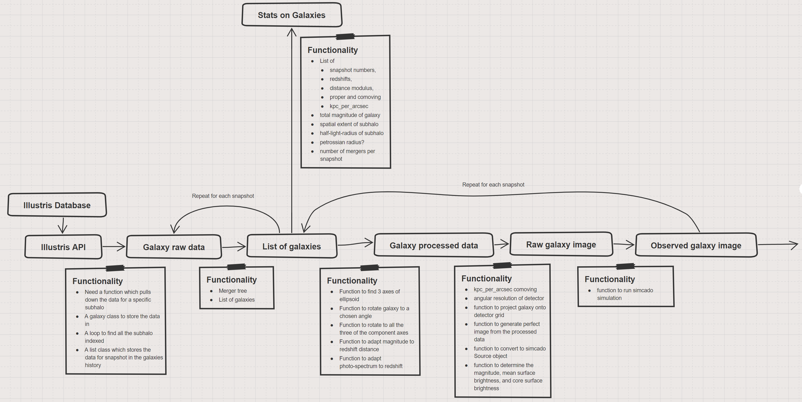

The idea for Illustris ELT
==========================
The main idea::

    What is the faintest and smallest galaxy in the Illustris sample that will be visible to the ELT

    Workflow for Illustris-ELT

Steps involved:
